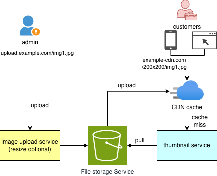

# ImgFlux

[](https://fsf.org/)
[](https://openjdk.org/projects/jdk/17/)
[](https://spring.io/projects/spring-boot)
[](https://github.com/cloud-media-forge/imgFlux/actions)

[English](README.md) | [中文](doc/README.zh-CN.md)

**ImgFlux** - High-performance image processing framework that processes 10,000 images/minute with GPU acceleration and
GraphicsMagick. Open-source alternative to remove.bg for bulk background removal.

## Architecture

The upload flow and thumbnail download flow are separated. Object storage is the only shared component between the two
flows.




## Features

- 🚀 **Image Upload API** - Support multiple image formats
- 📥 **Image Thumbnail & Resize API** - On-demand image size reduce & cropping
- 🎨 **Image Management Admin UI** - Visual management interface
- ⚡ **GraphicsMagick-based Processing** - High-performance image processing
- 🗄️ **Multiple Storage Backends** - MinIO, AWS S3, Alibaba Cloud OSS
- 🔧 **Configurable Storage Switching** - Flexible storage strategy
- 🔐 **JWT Authentication** - Secure API access control
- 🐳 **Docker Support** - Containerized deployment

## Feature Highlights

| Feature               | This Project          |
|-----------------------|-----------------------|
| Multi-storage backend | ✅ MinIO/S3/OSS        | 
| Image scaling         | ✅ GraphicsMagick      | 
| Management UI         | ✅ Built-in Admin UI   | 
| Modular design        | ✅ Independent modules | 
| Docker support        | ✅ Ready to use        | 
| JWT auth              | ✅ Built-in            |
| MCP Server (AI)       | ✅ Spring AI MCP       |

## Image Processing
### Thumbnail Examples

| Features                              | Original Image | After Operation                                                                                    |
|---------------------------------------|----------------|----------------------------------------------------------------------------------------------------|
| **Resize**                            |  |           |
| **Trim**                              |  |                     |
| **Extent**                            |  |          |
| **Quality**                           |  |                |
| **Text Translation** (Korean→English) |  |         |
| **Text Translation** (Korean→Chinese) |  |  |
## Image Flux Roadmap

We're planning to add AI-powered image processing features. See [Wiki](../../wiki) for details:

| Feature                | Description                                | Status         |
|------------------------|--------------------------------------------|----------------|
| Background removal     | Remove image backgrounds automatically     | ✅ Support      |
| Resize                 | Resize image size without lose quality     | ✅ Support      |
| Trim white background edge | Make image main subject look bigger        | ✅ Support      |
| Image  translation     | Translate text in screenshots              | ✅ Support     |
| OCR enhancement        | Enhance images for better text recognition | 📋 Planned     |
| Image upscale          | Upscale images with AI                     | 🚧 In Progress |
| Image deduplication    | Detect and remove duplicate images         | 📋 Planned     |
| Watermark removal      | Remove watermarks from images              | 📋 Planned     |
| Face anonymization     | Blur or anonymize faces in images          | 📋 Planned     |
| PDF/image cleanup      | Clean up scanned documents                 | 📋 Planned     |

| Comic/manga enhancement    | Enhance manga and comic images             | 📋 Planned     |

## Performance Benchmarks

| Tool            | Speed             | Memory  | GPU Support |
|-----------------|-------------------|---------|-------------|
| **ImgFlux**     | **1,200 img/min** | **2GB** | ✅ Yes       |
| OpenCV          | 300 img/min       | 5GB     | ❌ No        |
| Pillow (Python) | 150 img/min       | 3GB     | ❌ No        |
| ImageMagick     | 400 img/min       | 4GB     | ❌ No        |

**Key Performance Advantages:**

- 5x faster than OpenCV for batch image processing
- Java acceleration with optimized memory management
- GPU pipeline support for parallel processing
- Batch processing with memory optimization


## Free Alternative to Paid SaaS

ImgFlux provides open-source alternatives to popular paid image processing services:

- **remove.bg alternative** - Bulk background removal without subscription fees
- **Canva features alternative** - Automated image resizing and formatting
- **Photoshop automation alternative** - Batch image processing and optimization

## Use Cases

- **E-commerce** - Bulk product image optimization and resizing
- **OCR preprocessing** - Image enhancement for better text recognition
- **Social media moderation** - Automated image content filtering
- **Medical imaging** - Secure medical image storage and processing
- **Manga cleanup** - Comic and manga image enhancement
- **Content management** - Digital asset management for media companies

## MCP Server (AI Agent Integration)

The `imgFlux-mcp-server` module exposes ImgFlux's image processing capabilities as [MCP (Model Context Protocol)](https://modelcontextprotocol.io/) tools, enabling AI agents like Claude Desktop, Cursor, and other MCP-compatible clients to process images through natural language.

### MCP Server Feature Highlights

| Feature | Description |
|---------|-------------|
| **6 Image Tools** | `resizeImage`, `trimImage`, `convertImageFormat`, `translateImageText`, `processImage`, `getImageInfo` |
| **Natural Language Driven** | AI agents call tools based on user intent — no API knowledge required |
| **GraphicsMagick + Java2D Fallback** | Full performance with GM; pure Java fallback when GM is unavailable |
| **SSE Transport** | HTTP-based Server-Sent Events transport for broad client compatibility |
| **Spring AI MCP** | Built on [Spring AI MCP Server](https://docs.spring.io/spring-ai/reference/api/mcp.html) for standards-compliant integration |
| **Combined Operations** | `processImage` tool chains resize + trim + format + translation in one call |

### Available MCP Tools

| Tool | Description |
|------|-------------|
| `resizeImage` | Resize image to specified dimensions with quality control and format conversion |
| `trimImage` | Remove white/blank borders from images |
| `convertImageFormat` | Convert between JPG, PNG, WEBP, GIF formats |
| `translateImageText` | OCR-based text detection and translation on images (8 languages) |
| `processImage` | Combined operations: resize + trim + extent + format + translation |
| `getImageInfo` | Read image metadata: dimensions, format, file size |

### Integration Steps

#### 1. Build and Start the MCP Server

```bash
# Build from project root
mvn clean install -pl imgFlux-mcp-server -am

# Start the MCP server (default port: 8088)
mvn spring-boot:run -pl imgFlux-mcp-server
```

The server starts at `http://localhost:8088` with SSE transport enabled.

#### 2. Configure Your AI Client

**Claude Desktop** — Add to `claude_desktop_config.json`:

```json
{
  "mcpServers": {
    "imgflux": {
      "url": "http://localhost:8088/sse"
    }
  }
}
```

**Cursor** — Add to `.cursor/mcp.json` in your project root:

```json
{
  "mcpServers": {
    "imgflux": {
      "url": "http://localhost:8088/sse"
    }
  }
}
```

**Other MCP Clients** — Point your client's SSE transport to `http://localhost:8088/sse`.

#### 3. Verify the Connection

Once connected, ask your AI assistant:
- "What image processing tools are available?"
- "Resize `/path/to/image.png` to 800x600"
- "Remove the white borders from `/path/to/photo.jpg`"

### Usage Examples

#### Example 1: Resize an Image via Natural Language

**You:** "Resize `/photos/banner.png` to 1200x400 and save it as `/photos/banner-small.png`"

**AI** calls `resizeImage` with:
```json
{
  "inputPath": "/photos/banner.png",
  "outputPath": "/photos/banner-small.png",
  "width": 1200,
  "height": 400,
  "quality": 80,
  "format": "PNG"
}
```

**Result:** `Image resized to 1200x400 and saved to /photos/banner-small.png (245760 bytes)`

#### Example 2: Batch Workflow — Trim + Resize + Convert

**You:** "Clean up `/product/photo.jpg` — remove white borders, resize to 500x500, and convert to WEBP at `/product/photo.webp`"

**AI** calls `processImage` with:
```json
{
  "inputPath": "/product/photo.jpg",
  "outputPath": "/product/photo.webp",
  "width": 500,
  "height": 500,
  "quality": 85,
  "format": "WEBP",
  "trim": true,
  "extent": false,
  "srcLang": "",
  "toLang": ""
}
```

**Result:** `Image processed: resized 500x500 trimmed converted to WEBP -> /product/photo.webp (38400 bytes)`

#### Example 3: Translate Text on an Image

**You:** "Translate the Korean text on `/screenshots/app-ui.png` to English and save to `/screenshots/app-ui-en.png`"

**AI** calls `translateImageText` with:
```json
{
  "inputPath": "/screenshots/app-ui.png",
  "outputPath": "/screenshots/app-ui-en.png",
  "srcLang": "ko",
  "toLang": "en"
}
```

#### Example 4: Get Image Info

**You:** "What's the size and format of `/assets/logo.png`?"

**AI** calls `getImageInfo` and responds:

> "The image is 1024x768 pixels, PNG format, 245.3 KB."

## Project Structure

```
imgFlux/
├── imgFlux-engine/             # Image processing library
├── imgFlux-upload-api/         # Image upload REST API module
├── imgFlux-download-api/       # Image download and resize module
├── imgFlux-admin-ui/           # Admin UI module
├── imgFlux-mcp-server/         # MCP server for AI agent integration
```

## Quick Start

### Docker Compose (Recommended)

```bash
git clone 
cd imgFlux
docker-compose up -d -f docker-compose-develop.yml
# Access: http://localhost:8080
```

### Manual Start

```bash
mvn clean install
mvn spring-boot:run -pl imgFlux-upload-api
mvn spring-boot:run -pl imgFlux-download-api
mvn spring-boot:run -pl imgFlux-admin-ui
mvn spring-boot:run -pl imgFlux-mcp-server    # MCP server on port 8088
```

## Upload and Generate Thumbnail

### Upload an image:

```bash
curl http://localhost:8080/api/v1/upload/xxxx/xx.png
```

The response path is:

```text
xxxx/xx.png
```

Use the returned `path` to generate a thumbnail:

### Create a thumbnail
**Thumbnail URL structure**
```
  http://${yourDomain}/api/v1/thumbnail/resize/${resizeParam}/${url}
```
**Parameters**

- mode: `local` or `remote`
- resizeParam: format [width]x[height]q[qulity][ex][trim], example : 300x300q80trim
- url: image URL
    - local: image key in object storage
    - remote: image URL, example: https://brand.github.com/_next/static/media/logo-03.cc5e5332.png

**Local mode (image stored in object storage):**
```bash
path=xxxx/xx.png.webp
curl http://localhost:8080/api/v1/thumbnail/resize/local/240x240q90trim/${path}
// it will return an image with size=240x240, quality=90, convert format from png to webp 
```

**Remote mode (image from remote URL):**
```bash
curl "http://localhost:8080/api/v1/thumbnail/resize/remote/240x240q90trim/https://brand.github.com/_next/static/media/logo-03.cc5e5332.png"
// it will download the image from the remote URL and process it
```

**Alternative endpoint with query parameters:**
```bash
# Local mode
curl "http://localhost:8080/api/v1/thumbnail/forge/local/folder/image.png?width=240&height=240&quality=90&format=webp"

# Remote mode
curl "http://localhost:8080/api/v1/thumbnail/forge/remote/https://brand.github.com/_next/static/media/logo-03.cc5e5332.png?width=240&height=240&quality=90&format=webp"
```
### Online Demo
| <div style="width:150px">Features</div>           | <div style="width:150px">url</div>                                                          | <div style="width:200px">preview</div>                                                                |
|-------------------|---------------------------------------------------------------------------------------------|-------------------------------------------------------------------------------------------------------|
| **original**      | https://brand.github.com/_next/static/media/logo-03.cc5e5332.png                            |                            |
| **Resize 200x200** | http://thumbnail.rnh-inc.com/api/v1/thumbnail/resize/remote/200x200/https://brand.github.com/_next/static/media/logo-03.cc5e5332.png |                                                    |
| **Trim**          | http://thumbnail.rnh-inc.com/api/v1/thumbnail/resize/remote/200x200trim/https://brand.github.com/_next/static/media/logo-03.cc5e5332.png |                                                       |
| **Extent**        | http://thumbnail.rnh-inc.com/api/v1/thumbnail/resize/remote/200x200ex/https://brand.github.com/_next/static/media/logo-03.cc5e5332.png |                                                        |
| **Quality 5%**    | http://thumbnail.rnh-inc.com/api/v1/thumbnail/resize/remote/200x200q5/https://brand.github.com/_next/static/media/logo-03.cc5e5332.png |                                                       |
| **Convert format** | http://thumbnail.rnh-inc.com/api/v1/thumbnail/resize/remote/200x200q80/https://brand.github.com/_next/static/media/logo-03.cc5e5332.png.webp |                                          |
| **Text Translation** (Korean→English) | not available in Demo                                                                       |            |
| **Text Translation** (Korean→Chinese) | not available in Demo                                                                       |  |


## Tech Stack

- **Spring Boot 3.3** - Application framework
- **Java 17** - Programming language
- **GraphicsMagick** - Image processing engine
- **MinIO / AWS S3 / Alibaba Cloud OSS** - Object storage
- **JWT** - Authentication & authorization
- **H2 Database** - Embedded database
- **Thymeleaf** - Template engine
## Development

> Any company which access and use this product is welcome to register at the [address](https://github.com/cloud-media-forge/imgFlux/issues/1), only for product promotion purpose.

Welcome everyone’s attention and use, imgFlux will also embrace changes, sustainable development.

## Contributing

Contributions are welcome! Please see [CONTRIBUTING.md](doc/CONTRIBUTING.md) for details.

## License

This project is licensed under the [GPL License](LICENSE).

## Contact

- Issue reporting: [GitHub Issues](https://github.com/cloud-media-forge/imgFlux/issues)
