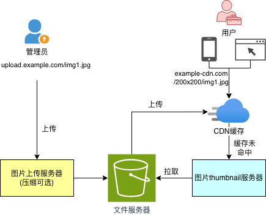

# ImgFlux

[](https://opensource.org/licenses/MIT)
[](https://openjdk.org/projects/jdk/17/)
[](https://spring.io/projects/spring-boot)
[](https://github.com/cloud-media-forge/imgFlux/actions)

[English](../README.md) | [中文](README.zh-CN.md)

**ImgFlux** - 高性能图片处理框架，支持 GPU 加速和 GraphicsMagick，每分钟可处理 10,000 张图片。批量背景移除的 remove.bg
开源替代方案。

## 架构图

上传流程和缩略图下载流程彼此独立，两个流程中只有对象存储是共享组件。



## 功能特性

- 🚀 **图片上传API** - 支持多种图片格式上传
- 📥 **图片下载和缩放API** - 按需缩放和裁剪图片
- 🎨 **图片管理Admin UI** - 可视化管理界面
- ⚡ **基于GraphicsMagick的图片处理** - 高性能图片处理
- 🗄️ **支持多种对象存储服务** - MinIO、AWS S3、阿里云OSS
- 🔧 **可配置的存储服务切换** - 灵活的存储策略
- 🔐 **JWT认证** - 安全的API访问控制
- 🐳 **Docker支持** - 容器化部署

## 功能亮点

| 功能       | 本项目              |
|----------|------------------|
| 多存储后端支持  | ✅ MinIO/S3/OSS   | 
| 图片缩放处理   | ✅ GraphicsMagick | 
| 管理界面     | ✅ 内置Admin UI     | 
| 模块化设计    | ✅ 独立模块           | 
| Docker支持 | ✅ 开箱即用           |
| JWT认证    | ✅ 内置             |

## 图片处理效果展示

| Features                    | Original Image | After Operation                                                                                       |
|-----------------------------|----------------|-------------------------------------------------------------------------------------------------------|
| **改变尺寸**                    |  |              |
| **独钓白边让主体更大**               |  |                        |
| **扩展图片**                    |  |             |
| **尺寸不变压缩质量**                |  |                   |
| **图片文字翻译** (Korean→English) |  |            |
| **图片文字翻译** (Korean→Chinese) |  |  |

## 图像功能规划

我们计划添加 AI 驱动的图像处理功能。

| 功能       | 描述        | 状态     |
|----------|-----------|--------|
| 背景移除     | 自动移除图片背景  | ✅ 支持   |
| 图片无损压缩   | 减少CDN成本、网络传输带宽 | ✅ 支持   |
| 自动剪裁白边   | 让图像主体看起来更大 | ✅ 支持   |
| 图片文字翻译   | 翻译截图中的文字  | ✅ 支持   |
| 图片放大     |  放大图片     | ✅ 支持   |
| OCR 增强   | 增强图片以提升文字识别效果 | 📋 计划中 |
| 图片去重     | 检测并删除重复图片 | 📋 计划中 |
| 添加水印     | 给图片添加水印   | 📋 计划中 |
| 水印移除     | 移除图片中的水印  | 📋 计划中 |
| 人脸匿名化    | 模糊或匿名化图片中的人脸 | 📋 计划中 |
| PDF/图片清理 | 清理扫描文档    | 📋 计划中 |
| 漫画/漫画增强  | 增强漫画和漫画图片      | 📋 计划中 |

## 性能基准测试

| 工具              | 处理速度           | 内存占用    | GPU支持 |
|-----------------|----------------|---------|-------|
| **ImgFlux**     | **1,200 张/分钟** | **2GB** | ✅ 支持  |
| OpenCV          | 300 张/分钟       | 5GB     | ❌ 不支持 |
| Pillow (Python) | 150 张/分钟       | 3GB     | ❌ 不支持 |
| ImageMagick     | 400 张/分钟       | 4GB     | ❌ 不支持 |

**核心性能优势：**

- 批量图片处理速度比 OpenCV 快 5 倍
- Java 加速与优化的内存管理
- GPU 流水线支持并行处理
- 批处理与内存优化


## 免费替代付费 SaaS

ImgFlux 为流行的付费图片处理服务提供开源替代方案：

- **remove.bg 替代方案** - 批量背景移除，无需订阅费用
- **Canva 功能替代** - 自动化图片调整大小和格式化
- **Photoshop 自动化替代** - 批量图片处理和优化

## 使用场景

- **电商** - 批量商品图片优化和调整大小
- **OCR 预处理** - 图片增强以提升文字识别效果
- **社交媒体审核** - 自动化图片内容过滤
- **医学影像** - 安全的医学图片存储和处理
- **漫画清理** - 漫画和漫画图片增强
- **内容管理** - 媒体公司的数字资产管理

## 项目结构

```
imgFlux/
├── image-process-engine/     # 图片处理公共库
├── imgFlux-upload-api/         # 图片上传REST API模块
├── imgFlux-download-api/       # 图片下载和resize模块
```

## 快速开始

### Docker Compose（推荐）

```bash
git clone  && cd imgFlux
docker-compose up -d -f docker-compose-develop.yml
# 访问: http://localhost:8080
```

### 手动启动

```bash
mvn clean install
mvn spring-boot:run -pl imgFlux-upload-api
mvn spring-boot:run -pl imgFlux-download-api
```

## 上传图片并生成缩略图

### 上传图片

```bash
curl http://localhost:8080/api/v1/upload/xxxx/xx.png
```

返回值中的路径为：

```text
xxxx/xx.png
```
### 生成缩略图
使用 upload 返回的 `path` 生成缩略图：

**本地模式（图片存储在对象存储中）：**
```bash
path=xxxx/xx.png.webp
curl http://localhost:8080/api/v1/thumbnail/resize/local/240x240q90trim/${path}
// 它将返回一张尺寸为240x240、质量为90、从png格式转换为webp格式的图片
```

**远程模式（图片来自远程URL）：**
```bash
curl "http://localhost:8080/api/v1/thumbnail/resize/remote/240x240q90trim/https://brand.github.com/_next/static/media/logo-03.cc5e5332.png"
// 它将从远程URL下载图片并进行处理
```

**使用查询参数的替代端点：**
```bash
# 本地模式
curl "http://localhost:8080/api/v1/thumbnail/forge/local/folder/image.png?width=240&height=240&quality=90&format=webp"

# 远程模式
curl "http://localhost:8080/api/v1/thumbnail/forge/remote/https://brand.github.com/_next/static/media/logo-03.cc5e5332.png?width=240&height=240&quality=90&format=webp"
```

### 在线演示缩略图
| <div style="width:50px">功能</div> | <div style="width:150px">url</div>                                                           | <div style="width:200px">预览</div>                                                                     |
|-------------------|----------------------------------------------------------------------------------------------|-------------------------------------------------------------------------------------------------------|
| **原图**            | https://brand.github.com/_next/static/media/logo-03.cc5e5332.png                             |                            |
| **压缩到尺寸 200x200** | http://thumbnail.rnh-inc.com/api/v1/thumbnail/resize/remote/200x200/https://brand.github.com/_next/static/media/logo-03.cc5e5332.png |                                                    |
| **去掉主体四周的白色背景**   | http://thumbnail.rnh-inc.com/api/v1/thumbnail/resize/remote/200x200trim/https://brand.github.com/_next/static/media/logo-03.cc5e5332.png |                                                       |
| **扩展到指定尺寸**       | http://thumbnail.rnh-inc.com/api/v1/thumbnail/resize/remote/200x200ex/https://brand.github.com/_next/static/media/logo-03.cc5e5332.png |                                                        |
| **压缩质量到 5%**      | http://thumbnail.rnh-inc.com/api/v1/thumbnail/resize/remote/200x200q5/https://brand.github.com/_next/static/media/logo-03.cc5e5332.png |                                                       |
| **转换格式**          | http://thumbnail.rnh-inc.com/api/v1/thumbnail/resize/remote/200x200q80/https://brand.github.com/_next/static/media/logo-03.cc5e5332.png.webp |                                          |
| **翻译图片上的文字** (Korean→English) | not available in Demo                                                                        |            |
| **翻译图片上的文字** (Korean→Chinese) | not available in Demo                                                                        |  |


## 技术栈

- **Spring Boot 3.3** - 应用框架
- **Java 17** - 编程语言
- **GraphicsMagick** - 图片处理引擎
- **MinIO / AWS S3 / 阿里云OSS** - 对象存储
- **JWT** - 认证授权
- **H2 Database** - 嵌入式数据库
- **Thymeleaf** - 模板引擎

## 贡献
接入的公司，欢迎在 [登记地址](https://github.com/cloud-media-forge/imgFlux/issues/1) 登记，登记仅仅为了产品推广。

欢迎大家的关注和使用，imgFlux也将拥抱变化，持续发展。

欢迎贡献！请查看 [CONTRIBUTING.zh-CN.md](doc/CONTRIBUTING.zh-CN.md) 了解详情。

## 许可证

本项目采用 [GPL 许可证](LICENSE)。

## 联系方式

- 问题反馈：[GitHub Issues](https://github.com/cloud-media-forge/imgFlux/issues)
